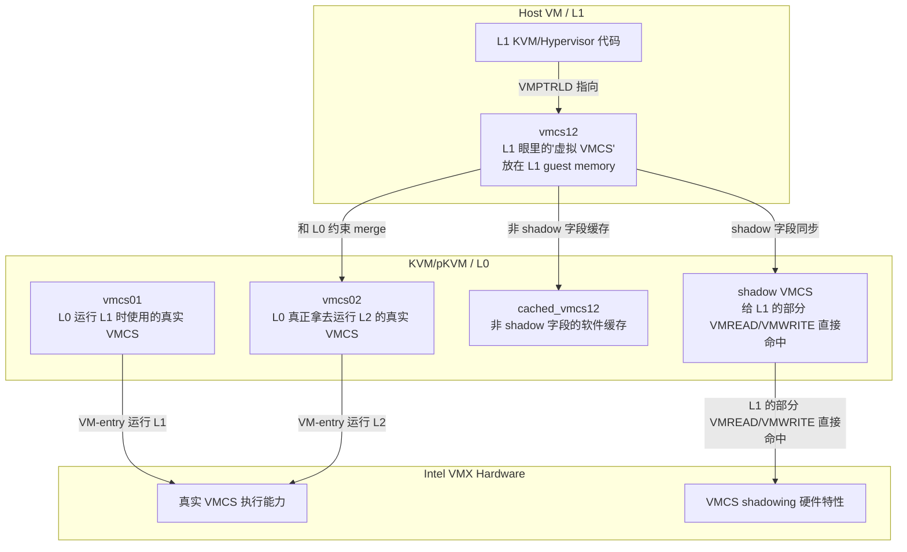
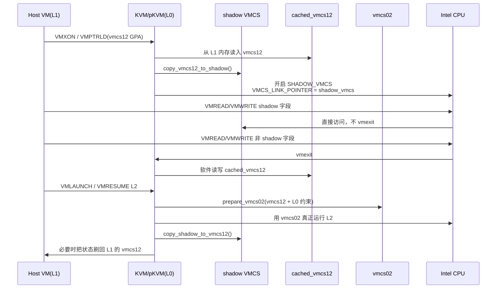

# pKVM-IA（pkvm-x86）Shadow VMCS 与 vmcs01/vmcs02/vmcs12 关系图解

更新时间：2026-03-17  
适用范围：`/home/mrgeek/pkvm-x86/pKVM-IA`

本文目标：把下面几个容易混淆的概念拆开：

- `shadow VMCS` 到底是不是硬件功能
- `vmcs01 / vmcs02 / vmcs12` 到底是什么
- pKVM-IA 到底是怎么使用 `shadow VMCS` 的
- 为什么讲 `shadow VMCS` 时一定会提到 `vmcs02`

---

## 1. 先说结论

- **`VMCS`** 是 Intel VT-x 的硬件概念。
- **`VMCS shadowing` / `shadow VMCS`** 也是 Intel VT-x 的硬件功能，不是 pKVM-IA 新发明的。
- **`vmcs01 / vmcs02 / vmcs12`** 不是新的硬件特性，而是 KVM/nested VMX 实现里对不同“角色的 VMCS 状态”的软件命名。
- **`vmcs02`** 不是一个额外硬件功能，它只是“L0 真正交给 CPU 去运行 L2 的那张硬件 VMCS 页”。
- pKVM-IA 使用 `shadow VMCS` 的场景是：**给被降权后的 host VM（L1）提供 nested VMX 能力**，让它还能像 hypervisor 一样管理自己的 L2。

换句话说：

- `shadow VMCS` 解决的是 “L1 如何高效地 `VMREAD/VMWRITE` 它的虚拟 VMCS”。
- `vmcs02` 解决的是 “L0 最终拿哪张 VMCS 去真正运行 L2”。

这两者不是同一个对象，所以讲 `shadow VMCS` 时必须同时讲 `vmcs02`。

---

## 2. 哪些是硬件功能，哪些是 KVM/pKVM 软件概念

### 2.1 硬件功能

- `VMX`
- `VMCS`
- `VMCS shadowing`

源码证据：

- `VMX_FEATURE_SHADOW_VMCS` 的注释明确写着：`VMREAD/VMWRITE in guest can access shadow VMCS`
  - `pKVM-IA/arch/x86/include/asm/vmxfeatures.h`
- KVM 会检测 CPU 是否支持该能力；不支持就关闭 `enable_shadow_vmcs`
  - `pKVM-IA/arch/x86/kvm/vmx/capabilities.h`
  - `pKVM-IA/arch/x86/kvm/vmx/nested.c`

### 2.2 KVM / pKVM 软件概念

- `vmcs01`
- `vmcs02`
- `vmcs12`
- `cached_vmcs12`
- `cached_shadow_vmcs12`

这些名字是 nested VMX 软件实现为了描述不同层次的 VMCS 状态而起的名字，不是 Intel 手册里的固定专有名词。

源码证据：

- `struct vmcs12 describes the state that our guest hypervisor (L1) keeps for a single nested guest (L2)`
  - `pKVM-IA/arch/x86/kvm/vmx/vmcs12.h`
- `nested_vmx_run() will use the data here to build the vmcs02: a VMCS for the underlying hardware which will be used to run L2`
  - `pKVM-IA/arch/x86/kvm/vmx/vmcs12.h`
- `loaded_vmcs points to the VMCS currently used in this vcpu. For a non-nested (L1) guest, it always points to vmcs01. For a nested guest (L2), it points to a different VMCS.`
  - `pKVM-IA/arch/x86/kvm/vmx/vmx.h`

---

## 3. 最小关系图

读图建议：

- `vmcs12`：L1 以为自己在操作的“虚拟 VMCS”
- `shadow VMCS`：给 L1 的硬件加速缓存页
- `cached_vmcs12`：那些没走硬件 shadow 的字段的软件缓存
- `vmcs02`：L0 最终真正交给 CPU 去运行 L2 的那张 VMCS

---

## 4. `vmcs01` / `vmcs02` / `vmcs12` 分别是什么

### 4.1 `vmcs01`

`vmcs01` 是 **L0 运行 L1 时使用的真实 VMCS**。

在 KVM 的命名里：

- `01` 表示 “L0 管 L1”
- 所以 `vmcs01` 是 host/L1 这个 guest 的运行 VMCS

源码依据：

- `struct loaded_vmcs vmcs01;`
  - `pKVM-IA/arch/x86/kvm/vmx/vmx.h`
- `loaded_vmcs` 在 non-nested 情况下一直指向 `vmcs01`
  - `pKVM-IA/arch/x86/kvm/vmx/vmx.h`

### 4.2 `vmcs12`

`vmcs12` 是 **L1 为自己的 L2 保存的“虚拟 VMCS”**。

它不是 CPU 正在执行的那张 VMCS，而是 L1 在 guest memory 里维护的一份“我想让 L2 这样运行”的配置。

源码依据：

- `vmcs12` 的注释明确写着它是 `guest hypervisor (L1) keeps for a single nested guest (L2)`
  - `pKVM-IA/arch/x86/kvm/vmx/vmcs12.h`

### 4.3 `vmcs02`

`vmcs02` 是 **L0 真正交给硬件去运行 L2 的真实 VMCS**。

它由 L0/KVM 根据：

- L1 提供的 `vmcs12`
- L0 自己对安全/截获/控制的要求（例如控制字段、EPT 指针等）

合并后生成。

源码依据：

- `prepare_vmcs02 is called when the L1 guest hypervisor runs its nested L2 guest`
  - `pKVM-IA/arch/x86/kvm/vmx/nested.c`
- `this function "merges" it with L0's requirements`
  - `pKVM-IA/arch/x86/kvm/vmx/nested.c`

因此：

- `vmcs12` 是 L1 的意图
- `vmcs02` 是 L0 真正执行的结果

---

## 5. pKVM-IA 到底怎么使用 `shadow VMCS`

### 5.1 目标

pKVM 在 Intel x86 上把原本跑在 VMX root mode 的 host Linux 降成了一个 host VM。  
这意味着 host 里的 KVM 现在是 L1，它如果还想继续跑自己的 guest（L2），就需要一套 `vVMX` 能力。

文档原话：

- host 变成 `host VM`
- 上面会看到 `vVMX, vEPT, vIOMMU`
  - `pKVM-IA/Documentation/virt/kvm/x86/pkvm-intel.rst`

所以，pKVM 使用 `shadow VMCS` 的直接目的不是保护 pVM，而是：

- 让 L1 还能继续用 `VMREAD/VMWRITE/VMPTRLD/VMLAUNCH/...` 这套 VMX 模型去管理它的 L2
- 同时尽量减少每次访问虚拟 VMCS 都 vmexit 的开销

### 5.2 建立阶段

L1 执行 `VMXON` 后，KVM 会进入 nested VMX 模式，并分配：

- `vmcs02`
- `cached_vmcs12`
- `cached_shadow_vmcs12`
- `shadow VMCS`

源码：

- `enter_vmx_operation()`
  - `pKVM-IA/arch/x86/kvm/vmx/nested.c`

### 5.3 告诉硬件“这里有 shadow VMCS”

当 L1 执行 `VMPTRLD` 后，KVM 会：

- 打开 `SECONDARY_EXEC_SHADOW_VMCS`
- 把 `VMCS_LINK_POINTER` 指向 `vmx->vmcs01.shadow_vmcs`
- 标记 `need_vmcs12_to_shadow_sync = true`

源码：

- `set_current_vmptr()`
  - `pKVM-IA/arch/x86/kvm/vmx/nested.c`

这一步就是“把 shadow VMCS 连接到硬件 VMX 流程里”的关键。

### 5.4 同步 `vmcs12 -> shadow VMCS`

进入 guest 前，如果 `need_vmcs12_to_shadow_sync` 置位，就会执行：

- `nested_sync_vmcs12_to_shadow()`
- 最终走 `copy_vmcs12_to_shadow()`

源码：

- `pKVM-IA/arch/x86/kvm/pkvm/vmx/vmx.c`
- `pKVM-IA/arch/x86/kvm/vmx/nested.c`

注意这里不是把整个 `vmcs12` 原封不动塞进去，而是只同步“允许 shadow”的字段。

### 5.5 哪些字段会进 `shadow VMCS`

白名单在：

- `pKVM-IA/arch/x86/kvm/vmx/vmcs_shadow_fields.h`

典型字段有：

- `GUEST_RIP`
- `GUEST_RSP`
- `GUEST_CR0`
- `GUEST_CR3`
- `GUEST_CR4`
- `GUEST_RFLAGS`
- `CPU_BASED_VM_EXEC_CONTROL`
- `EXCEPTION_BITMAP`

也就是说，`shadow VMCS` 不是完整的 `vmcs12`，而是一个“热点字段的硬件缓存页”。

### 5.6 L1 执行 `VMREAD/VMWRITE` 时发生什么

#### 情况 A：字段在 shadow 白名单里

CPU 可以直接命中 `shadow VMCS`，不需要每次都 vmexit 到 L0。

这就是硬件 `VMCS shadowing` 真正带来的性能收益。

#### 情况 B：字段不在 shadow 白名单里

还是会 vmexit 到 L0，然后由软件路径处理：

- `handle_vmread()`
- `handle_vmwrite()`

这些路径会读写 `cached_vmcs12`。

源码：

- `pKVM-IA/arch/x86/kvm/vmx/nested.c`

所以本质上是“两级存储”：

- 快路径：`shadow VMCS`
- 慢路径：`cached_vmcs12`

### 5.7 真正运行 L2 时为什么还需要 `vmcs02`

因为 CPU 真正 `VMLAUNCH/VMRESUME` 跑 L2 时，必须用一张 **真实执行态 VMCS**。  
这张执行态 VMCS 不能直接等于 L1 的 `vmcs12`，原因是：

- L1 的 `vmcs12` 只是意图，不可信
- L0/pKVM 还要强加自己的安全/截获要求
- 例如控制字段、异常拦截、EPT 指针等必须由 L0 最终决定

所以 KVM 会在运行 L2 之前执行：

- `prepare_vmcs02()`

把：

- `vmcs12` 的请求
- `vmcs01` / L0 自己的要求

merge 成 `vmcs02`。

源码：

- `pKVM-IA/arch/x86/kvm/vmx/nested.c`

因此，**`shadow VMCS` 不是最终执行对象，`vmcs02` 才是最终执行对象。**

### 5.8 回写阶段：`shadow VMCS -> vmcs12`

当：

- `VMCLEAR`
- `VMXOFF`
- 切换当前 `vmptr`

等场景发生时，KVM 会在 `nested_release_vmcs12()` 里：

- 先把 shadow page 中被 guest 修改过的字段拷回 `vmcs12`
- 再把 `cached_vmcs12` 刷回 guest memory

源码：

- `copy_shadow_to_vmcs12()`
  - `pKVM-IA/arch/x86/kvm/vmx/nested.c`
- `nested_release_vmcs12()`
  - `pKVM-IA/arch/x86/kvm/vmx/nested.c`

---

## 6. 时序图

---

## 7. 为什么 `shadow VMCS` 不等于 “保护 pVM vCPU 状态”

这里最容易混淆。

`shadow VMCS` 解决的问题是：

- “L1 如何高效访问它的虚拟 VMCS”

而 pVM vCPU 状态保护解决的问题是：

- “host 不能在 pVM 启动后继续读/写其关键寄存器状态”

这是两条完全不同的路径。

在 pKVM-IA 中，pVM 的状态保护靠的是：

- `guest_state_protected`
- hypervisor 私有 vCPU 状态
- FPU/XSTATE 的 confidential 管理
- host 访问接口收口

源码线索：

- `pKVM-IA/arch/x86/kvm/vmx/pkvm_high.c`
- `pKVM-IA/arch/x86/kvm/pkvm/pkvm.c`
- `pKVM-IA/arch/x86/kvm/pkvm/fpu/core.c`

因此：

- `shadow VMCS` 是 **nested virtualization / vVMX 加速**
- pVM vCPU state protection 是 **机密性/完整性保护**

不要把它们当成同一个机制。

---

## 8. 一句话记忆法

可以用下面这句记忆：

> `vmcs12` 是 L1 以为自己在写的配置，`shadow VMCS` 是给 L1 的硬件缓存，`cached_vmcs12` 是软件缓存，`vmcs02` 是 L0 最终交给 CPU 去跑 L2 的执行态 VMCS。

---

## 9. 参考源码路径

- `pKVM-IA/arch/x86/include/asm/vmxfeatures.h`
- `pKVM-IA/arch/x86/kvm/vmx/capabilities.h`
- `pKVM-IA/arch/x86/kvm/vmx/vmcs.h`
- `pKVM-IA/arch/x86/kvm/vmx/vmcs12.h`
- `pKVM-IA/arch/x86/kvm/vmx/vmcs_shadow_fields.h`
- `pKVM-IA/arch/x86/kvm/vmx/vmx.h`
- `pKVM-IA/arch/x86/kvm/vmx/nested.c`
- `pKVM-IA/arch/x86/kvm/pkvm/vmx/vmx.c`
- `pKVM-IA/Documentation/virt/kvm/x86/pkvm-intel.rst`
