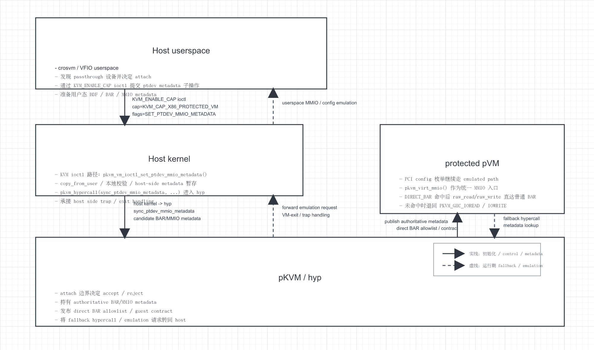

# [B3-1] protected pVM 设备透传第一阶段上层方案

## 状态

- 当前状态: 进行中（上层方案收敛）
- 所属主任务: `pkvm-x86#13`
- 关联任务: `B3`
- 关联 Bug: `pkvm-x86#5`

## 目的

在继续细化 guest/hyp 的 MMIO contract 之前，先把第一阶段准备实现的能力边界定死，避免后续在 ioctl、hypercall、metadata 结构上反复返工。

这份文档只回答 4 件事：

- 第一阶段要支持什么
- 第一阶段明确不支持什么
- trust boundary 放在哪里
- 实现顺序应该怎么排

## 图形化总览

下面这次改成了更接近架构框图的画法：方框表示参与层级和关键部分，箭头表示数据流/控制流。图里只保留第一阶段最关键的闭环，不把第二阶段之后的生命周期问题塞进去。



- 实线箭头：初始化阶段的控制流 / metadata 安装与发布
- 虚线箭头：运行期 fallback / emulation 往返路径
- SVG 源文件：`artifacts/01C-1-B3-1-protected-pVM-设备透传第一阶段上层方案-框图.svg`

- 第一阶段最小闭环：单 `VFIO PCI`、静态 attach、`NoIommu`、基础 `PCI` 枚举、普通 `BAR MMIO`
- 明确非目标：`vIOMMU`、`hotplug/remove-path`、`migration`、`MSI-X` 直达、完整 `teardown`、`DMA mirror` 生命周期
- 后续衔接：先推进 `B3-2 metadata contract`，再回到 `T2 / T3 / T4 DMA mirror` 主线

这里要区分两种不同的“分层”口径：

- 执行层级：`userspace -> Host kernel / KVM -> pKVM/hyp -> protected pVM`
- trust domain：`userspace` 和 `Host kernel / KVM` 虽然执行层级不同，但在这份方案里都仍属于 host side；真正的 authoritative metadata 不能停在这两层，而要停在 `pKVM/hyp`

## 为什么先做这一层

- 当前更深的 blocker 已经不是单纯的 crosvm fallback，而是 protected pVM 自身还没有成立的 passthrough MMIO 语义：
  - guest 当前会先把 `pv_ops.mmio.raw_*` 和 `pv_ops.mmio.pci_mmcfg_*` 汇聚到 `pkvm_virt_mmio()`；命中 allowlist 的 `DIRECT_BAR` 时 direct `raw_read*/raw_write*`，未命中时才退回 `PKVM_GHC_IOREAD/IOWRITE`，见 [pkvm.c](/home/mrgeek/pkvm-x86/pKVM-IA/arch/x86/coco/pkvm/pkvm.c)。
  - host -> pKVM 的透传接口当前只传 `BDF/PASID`，没有 BAR/resource 元数据，见 [pkvm_host.c](/home/mrgeek/pkvm-x86/pKVM-IA/arch/x86/kvm/vmx/pkvm/pkvm_host.c) 和 [ptdev.c](/home/mrgeek/pkvm-x86/pKVM-IA/arch/x86/kvm/vmx/pkvm/hyp/ptdev.c)。
- 如果不先限定第一阶段目标，底层实现会同时牵扯：
  - config path
  - BAR MMIO
  - MSI-X
  - DMA mirror
  - remove-path
  - hotplug
  - teardown
- 这会让验证面过大，难以做到“一个任务一个任务验证”。

## 第一阶段目标

第一阶段不追求“完整、通用、安全性完全收口的设备透传框架”，只追求一个最小可验证闭环：

- protected pVM
- 单个 VFIO PCI 设备
- 静态 attach
- `NoIommu`
- guest 能完成基础 PCI 枚举
- guest 能访问 passthrough 设备的普通 BAR MMIO
- 后续再进入 DMA mirror 主线

换句话说，第一阶段的目标是先把“最基础的寄存器访问链”打通，而不是一次性把全部生命周期能力补齐。

## 第一阶段明确支持的范围

- PCI config space 继续走现有 emulated 路径
  - 原因：当前 config 访问链虽然不稳，但客观上已经存在 guest -> hypercall -> host MMIO emulation -> crosvm `PciConfigMmio` 这条路径，见 [pkvm.c](/home/mrgeek/pkvm-x86/pKVM-IA/arch/x86/coco/pkvm/pkvm.c)、[x86.c](/home/mrgeek/pkvm-x86/pKVM-IA/arch/x86/kvm/x86.c)、[pci_root.rs](/home/mrgeek/pkvm-x86/crosvm/devices/src/pci/pci_root.rs)。
- 普通 BAR MMIO 作为第一阶段优先打通的访问面
  - 原因：guest 驱动真正驱动设备时，关键路径通常是 BAR 寄存器访问；而 crosvm/VFIO 已有 BAR mmap 骨架，见 [vfio_pci.rs](/home/mrgeek/pkvm-x86/crosvm/devices/src/pci/vfio_pci.rs)。
- 仍以 `donate + pVM DMA mirror pgtable` 作为后续主线，不改总方向
  - 原因：T1 之后已经确认 DMA/IOMMU 主线仍要落在 `pgstate_pgt -> ptdev->pgt -> IOMMU SLPTR` 这条骨架上，见 [ept.c](/home/mrgeek/pkvm-x86/pKVM-IA/arch/x86/kvm/vmx/pkvm/hyp/ept.c)、[ptdev.c](/home/mrgeek/pkvm-x86/pKVM-IA/arch/x86/kvm/vmx/pkvm/hyp/ptdev.c)、[shadow_iommu.c](/home/mrgeek/pkvm-x86/pKVM-IA/arch/x86/kvm/vmx/pkvm/hyp/shadow_iommu.c)。

## 第一阶段明确非目标

以下内容不进入第一阶段：

- `vIOMMU`
- 动态 hotplug
- device remove-path
- migration
- 多设备共享状态机
- MSI-X table / PBA 直达
- 通用化覆盖所有 VFIO region
- teardown 生命周期完全收口
- DMA mirror 与 MMIO 语义一次性一起实现

这不是否定这些能力，而是避免第一阶段目标膨胀。

## 第一阶段 trust boundary

第一阶段也不能退化成“host 说了算”的普通 KVM 模式。

推荐边界是：

```text
userspace (VMM / crosvm)
    发现设备
    组织 ioctl 参数 / 用户态 metadata
        |
        v
Host kernel / KVM
    pkvm_vm_ioctl_set_ptdev_mmio_metadata()
    copy_from_user + 本地校验 + pkvm_hypercall(sync_ptdev_mmio_metadata)
        |
        v
pKVM/hyp
    最终接受或拒绝
    持有 authoritative metadata
        |
        v
guest
    只信任 pKVM/hyp 暴露的 metadata
```

以 `KVM_CAP_X86_PROTECTED_VM_FLAGS_SET_PTDEV_MMIO_METADATA` 为例，当前源码里的实际调用层级更接近：

```text
userspace (crosvm, boot-time PCI / VFIO path)
    VfioPciDevice::build_protected_vm_ptdev_mmio_metadata()   (crosvm/devices/src/pci/vfio_pci.rs)
        枚举 VFIO sparse mmap BAR 子区间
        remove_bar_mmap_msix()
        生成 ProtectedVmPtdevMmioMetadata { generation = 1, flags = 0, ranges = [...] }
    generate_pci_root()                                       (crosvm/arch/src/lib.rs)
        submit_protected_vm_ptdev_mmio_metadata()
            device.get_protected_vm_ptdev_mmio_metadata()     (crosvm/devices/src/pci/pci_device.rs)
                VfioPciDevice::get_protected_vm_ptdev_mmio_metadata()
            vm.set_protected_vm_ptdev_mmio_metadata()
                KvmVm::set_protected_vm_ptdev_mmio_metadata() (crosvm/hypervisor/src/kvm/x86_64.rs)
                    ioctl(vm_fd, KVM_ENABLE_CAP, &cap)
                        cap.cap   = KVM_CAP_X86_PROTECTED_VM
                        cap.flags = KVM_CAP_X86_PROTECTED_VM_FLAGS_SET_PTDEV_MMIO_METADATA
                        cap.args[0] = userspace metadata pointer
                        |
                        v
Host kernel / KVM
    pkvm_vm_ioctl_set_ptdev_mmio_metadata()
        pkvm_copy_ptdev_mmio_metadata_from_user()
        pkvm_sync_ptdev_mmio_metadata()
            pkvm_hypercall(sync_ptdev_mmio_metadata, ...)
                |
                v
pKVM/hyp
    pkvm_sync_ptdev_mmio_metadata()
        pkvm_set_ptdev_mmio_metadata()
```

- 对当前 boot-time 设备启动主路径，`submit_protected_vm_ptdev_mmio_metadata()` 的直接调用者应写成 `generate_pci_root()`，不是 `configure_pci_device()`。
- `configure_pci_device()` 也复用了同一个 helper，但更适合描述另一条 add-device / hotplug 风格路径，而不是当时 boot-time VFIO attach 的主线。

这样设计的依据是：

- 当前 `ptdev` attach 已经是“host 发起，pKVM/hyp 最终落地状态”的模式，见 [pkvm_host.c](/home/mrgeek/pkvm-x86/pKVM-IA/arch/x86/kvm/vmx/pkvm/pkvm_host.c)、[pkvm.c](/home/mrgeek/pkvm-x86/pKVM-IA/arch/x86/kvm/vmx/pkvm/hyp/pkvm.c)、[ptdev.c](/home/mrgeek/pkvm-x86/pKVM-IA/arch/x86/kvm/vmx/pkvm/hyp/ptdev.c)。
- 当前 guest 的 `PKVM_GHC_IOREAD/IOWRITE` 在 pKVM/hyp 中会转发给 host，见 [vmx.c](/home/mrgeek/pkvm-x86/pKVM-IA/arch/x86/kvm/pkvm/vmx/vmx.c)。这条模式已经说明“最终真相停在 host”是当前问题的一部分，不适合继续扩大。

## 第一阶段技术策略

### 访问面切分

- config space:
  - 继续 emulated
- 普通 BAR MMIO:
  - 作为第一阶段主攻方向
- MSI-X table / PBA:
  - 继续 emulate，或显式屏蔽为第一阶段非目标

### 为什么先打 BAR MMIO

- guest 驱动的设备 bring-up 通常真正依赖 BAR 寄存器。
- crosvm 已经能从 VFIO 获取 BAR mmap 子区间并映射到 guest GPA，见 [vfio_pci.rs](/home/mrgeek/pkvm-x86/crosvm/devices/src/pci/vfio_pci.rs) 和 [vfio.rs](/home/mrgeek/pkvm-x86/crosvm/devices/src/vfio.rs)。
- `io.h` 里保留了 `raw_read* / raw_write*`，见 [io.h](/home/mrgeek/pkvm-x86/pKVM-IA/arch/x86/include/asm/io.h)。这意味着 guest 侧理论上可以在 `pkvm_virt_mmio()` 做分流后，回到原始 MMIO 读写，而不必重做整个 x86 MMIO 宏层。

### 为什么 config 不作为第一阶段主攻方向

- config 路径现在虽然也有问题，但仍已有一条可工作的软件 emulation 骨架。
- BAR MMIO 则是当前设备驱动真正无法继续的更深 blocker。
- 若 config、BAR、MSI-X 一起改，会把第一阶段复杂度显著拉高。

## ARM pKVM 参考结论

### 结论

- ARM64 的 pKVM/AVF 确实是当前最值得参考的成熟实现。
- 但参考重点应是“上层模式和 trust boundary”，而不是直接照搬某个具体实现文件。
- 原因是 ARM 这条线已经把以下三件事做得比较清楚：
  - pKVM/guest 的 memory ownership 与 share/unshare 模型
  - guest 对 MMIO 与共享内存的显式分类
  - 设备 assignment 所需的 metadata 通道和验证链

### 为什么说它更成熟

- Android 官方文档明确说明 AVF 的参考实现当前仅限 ARM64，x86_64 只支持非 protected VM 测试：
  - `https://source.android.com/docs/core/virtualization/architecture`
- ARM guest 侧已经有面向 protected guest 的标准 hypercall 文档：
  - `MEM_SHARE / MEM_UNSHARE`
  - `MMIO_GUARD`
  - `https://docs.kernel.org/virt/kvm/arm/hypercalls.html`
- Android common kernel 的 ARM pKVM 已经有完整的 `arch/arm64/kvm/hyp/nvhe/` 目录，以及 host 侧 `arch/arm64/kvm/pkvm.c`。
- Android AVF 还已经有设备 assignment 文档，且明确要求用 VM DTBO 描述 physical reg、IOMMU、device properties 和 dependencies：
  - `https://android.googlesource.com/platform/packages/modules/Virtualization/+/refs/tags/aml_ase_351114000/docs/device_assignment.md`

### 对当前 x86 方案最有价值的参考点

- 不是“ARM 怎么做 PCI config”，而是：
  - host 先发现设备，再由 pKVM/hyp 持有 authoritative metadata
  - guest 对 MMIO 访问不是无条件都走 hypercall，而是存在显式分类机制
  - 设备 assignment 依赖一份独立的、结构化的设备资源描述，而不是只靠 VMM 临时拼装
- 其中最关键的映射关系是：
  - ARM 的 VM DTBO / pvmfw / assignable device manifest
    - 对应我们当前 x86 缺失的 “BAR/MMIO metadata contract”
  - ARM 的 `MMIO_GUARD`
    - 对应我们当前 x86 需要补的 “哪些 GPA/IPA 走 emulation，哪些走直达”
  - ARM 的 memory share/unshare
    - 对应我们当前 x86 已经在走、但仍需和 DMA mirror 收敛的 donation/share 语义

### 不能直接照搬的地方

- ARM AVF 当前设备 assignment 主要是 `vfio-platform` + DT/DTBO 模式，不是通用 PCI/VFIO-pci 模式。
- ARM 官方文档推荐的 IOMMU 参考架构是 SMMU，而我们这里面对的是 x86 PCI + VT-d / vIOMMU / BAR/config 语义。
- ARM 那边很多 guest 设备发现依赖 DT/pvmfw；x86 这里则天然要面对 PCI config space、BAR、MSI-X 和 ACPI/ECAM 语义。

### 对当前阶段的直接启发

- B3-1 仍然成立，而且更有依据：
  - 第一阶段先定上层方案
  - 再定义 metadata contract
  - 再实现 guest MMIO 分流
- 当前 x86 主线不应继续围绕临时 crosvm workaround 打转，而应优先补：
  - 一份由 pKVM/hyp 最终持有的设备 MMIO metadata
  - 一套 guest 可消费的 MMIO 分类机制
- 当前 ARM 参考源清单见：
  - [ARM-pKVM-参考源.md](/home/mrgeek/pkvm-x86/DOCS/需求/分析当前pKVM-IA对设备透传的支持情况/参考实现/ARM-pKVM-参考源.md)
- 当前 ARM -> x86 设计映射见：
  - [ARM-pKVM-到-x86-设计映射表.md](/home/mrgeek/pkvm-x86/DOCS/需求/分析当前pKVM-IA对设备透传的支持情况/参考实现/ARM-pKVM-到-x86-设计映射表.md)

## 第一阶段推荐实现顺序

1. 先定上层方案
   - 也就是本文件
2. 再细化 B3-2
   - guest/hyp 的 passthrough MMIO contract
   - 设备 metadata 通道
3. 再进入实现
   - 先解决 guest 对普通 BAR MMIO 的访问语义
4. 之后回到主线
   - `T2` `pgstate_pgt` 收敛为 DMA mirror
   - `T3` donate 后同步 runtime DMA mirror
   - `T4` teardown 前 quiesce ptdev DMA

## 第一阶段验收标准

第一阶段如果进入实现，验收口径应收敛成：

- protected pVM 可带单个 VFIO PCI 设备启动
- guest 不再因为当前 MMIO 语义直接在早期 vCPU 运行阶段掉进 `EFAULT`
- guest 能完成最小化设备枚举和普通 BAR 寄存器访问
- 不要求第一阶段就证明 DMA、remove-path、hotplug、MSI-X、teardown 已全部正确

## 下一步

- 在本文件约束下继续推进 B3-2。
- B3-2 只需要回答：
  - BAR/MMIO metadata 最小结构是什么
  - 这份 metadata 如何进入 pKVM/hyp
  - guest 在哪里查询并按 GPA 做分流
- 在 B3-2 完成之前，不继续扩大战术性的 crosvm workaround。
