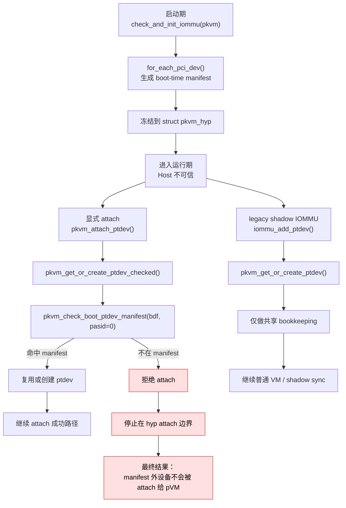

# [B5-1] 启动期 `platform manifest` 可信设备名单方案

## 状态

- 当前状态: 已完成（实现与主验证已收口；B5 剩余问题已前移到 Guest EPT 建图边界）
- 所属主任务: `pkvm-x86#20`
- 关联任务: `B5`
- 实现任务: `pkvm-x86#21`

## 要解决的问题

这份文档只解决 `B5` 的问题 1：

- **如何阻止运行期不在启动期可信名单里的设备，被 attach 给 pVM**

也就是：

- 热插的新 PCI function
- 运行期新创建的 VF
- 启动阶段不在设备全集里的新 endpoint / 新 function

这份文档**不**解决：

- protected pVM Guest EPT `GPA -> HPA` 建图在运行期 Host 不可信前提下是否仍可被影响或篡改

那个问题继续留在 `B5` 主文档讨论。

## 当前实现范围

当前第一阶段只考虑下面这组边界：

- **Host IOMMU = legacy mode**
- **只处理 `pasid == 0`**
- **单 segment**
- **不覆盖 hot-remove / slot reuse**

这里“单 segment”是现有代码路径本身带来的边界，不是额外目标：

- Host attach 路径当前传给 hyp 的是 `PCI_DEVID(bus, devfn)`，见 `/home/mrgeek/pkvm-x86/pKVM-IA/arch/x86/kvm/vmx/pkvm/pkvm_host.c`
- 当前 `SET_PTDEV_MMIO_METADATA` 通路也明确拒绝 `segment != 0`，见同文件

## 方案结论

对于问题 1，当前最合适的实现方式是：

1. 启动阶段基于 host kernel 已完成的 PCI 枚举，生成一份 `platform manifest`
2. 在 `check_and_init_iommu(pkvm)` 阶段把这份 manifest 冻结到 `struct pkvm_hyp`
3. 运行期把检查点放在 hyp 的 **pVM attach 边界**，而不是只放在 Host 路径
4. 显式 attach 路径走 checked helper；legacy shadow IOMMU 共享路径只保留锁内 get/create，不承载 manifest enforcement

最终效果是：

- **manifest 外设备无法通过显式 attach 进入 pVM 管理路径**
- **普通 VM / host shadow IOMMU bookkeeping 不会因为 manifest miss 被错误拦截**

## 当前源码事实

### 1. 启动阶段的设备全集，host-side pKVM 已经能看到

当前代码里已经有足够的启动期输入来源：

- `check_pci_device_count()` 会遍历 `for_each_pci_dev()`，见 `/home/mrgeek/pkvm-x86/pKVM-IA/arch/x86/kvm/vmx/pkvm/pkvm_host.c`
- `__vmx_pkvm_init()` 会分配 `pkvm_hyp`，随后走 `check_and_init_iommu(pkvm)`，见 `/home/mrgeek/pkvm-x86/pKVM-IA/arch/x86/kvm/vmx/pkvm/pkvm_host.c`
- `struct pkvm_hyp` 本来就承载启动早期冻结状态，见 `/home/mrgeek/pkvm-x86/pKVM-IA/arch/x86/kvm/vmx/pkvm/include/pkvm.h`

这说明把 boot-time manifest 冻结进 `pkvm_hyp`，是顺着现有骨架扩展，不是另起一套机制。

### 2. 运行期显式 attach 现在主要由 Host 驱动

当前显式 attach 主链是：

```text
userspace / crosvm
    -> KVM_DEV_VFIO_FILE_ADD
        -> kvm_vfio_file_add()
            -> kvm_arch_add_device_to_pkvm()
                -> add_device_to_pkvm()
                    -> pkvm_hypercall(add_ptdev, vm_handle, bdf, 0)
                        -> pkvm_attach_ptdev()
```

对应源码入口：

- `/home/mrgeek/pkvm-x86/pKVM-IA/virt/kvm/vfio.c`
- `/home/mrgeek/pkvm-x86/pKVM-IA/arch/x86/kvm/vmx/pkvm/pkvm_host.c`
- `/home/mrgeek/pkvm-x86/pKVM-IA/arch/x86/kvm/vmx/pkvm/hyp/ptdev.c`

### 3. legacy shadow IOMMU 路径也会隐式创建 `ptdev`

当前 legacy shadow IOMMU 路径里：

```text
Host 修改 legacy context entry
    -> sync_shadow_context_entry()
        -> iommu_add_ptdev()
            -> pkvm_alloc_ptdev()
```

对应源码入口：

- `/home/mrgeek/pkvm-x86/pKVM-IA/arch/x86/kvm/vmx/pkvm/hyp/shadow_iommu.c`

这也是为什么 checked create 仍然有必要：

- **如果 `pkvm_attach_ptdev()` 继续分离 `get` / `alloc`，manifest 校验和创建之间仍会留下竞态窗口**
- **如果只保留 `pkvm_alloc_ptdev()` 这种裸原语，attach 边界的策略很容易再次散落**

## 为什么 enforcement 应卡在 `pkvm_attach_ptdev()` 边界

问题 1 真正要钉住的不是“某个 ioctl 要不要报错”，而是：

- **manifest 外设备不能通过显式 attach 成功进入 pVM**

因为真正发生“把设备交给某个 pVM”这件事的，是：

- `kvm_vfio_file_add()`
- `kvm_arch_add_device_to_pkvm()`
- `add_device_to_pkvm()`
- `pkvm_attach_ptdev()`

也就是说，只要把规则卡在 `pkvm_attach_ptdev()` 进入 attach 成功分支之前，就已经足够解决：

- Host 把 manifest 外设备显式 attach 给 pVM

而 `shadow_iommu.c` 里的 `iommu_add_ptdev()` 虽然也会 materialize `ptdev`，但它服务的是共享的 IOMMU shadow bookkeeping；源码里也明确存在“未 attach 到 VM 的 ptdev”分支，说明这条路径并不等于“把设备授权给 pVM”。

## 需要改的点

### 1. 启动期 manifest 存储与构造

文件：

- `/home/mrgeek/pkvm-x86/pKVM-IA/arch/x86/kvm/vmx/pkvm/include/pkvm.h`
- `/home/mrgeek/pkvm-x86/pKVM-IA/arch/x86/kvm/vmx/pkvm/pkvm_host.c`

改动：

- 在 `struct pkvm_hyp` 中增加 boot-time manifest 存储
- 在 `check_and_init_iommu(pkvm)` 阶段基于 `for_each_pci_dev()` 生成 manifest

### 2. hyp 统一检查入口

文件：

- `/home/mrgeek/pkvm-x86/pKVM-IA/arch/x86/kvm/vmx/pkvm/hyp/ptdev.h`
- `/home/mrgeek/pkvm-x86/pKVM-IA/arch/x86/kvm/vmx/pkvm/hyp/ptdev.c`

改动：

- 新增 `pkvm_boot_ptdev_manifest_lookup(u16 bdf)`
- 新增 `pkvm_check_boot_ptdev_manifest(u16 bdf, u32 pasid, ...)`
- 新增锁内 unchecked `get/create` helper
- 新增 `pkvm_get_or_create_ptdev_checked(..., struct pkvm_ptdev **ptdev)`

同时明确：

- **`pkvm_alloc_ptdev()` 继续只做裸分配**
- **manifest 策略不直接塞进 `pkvm_alloc_ptdev()`**
- **shared shadow-IOMMU bookkeeping 继续复用 lock-safe unchecked helper**
- **checked helper 对 attach 路径必须先做 manifest check，再允许 `get/create`，避免普通 VM 先物化 `ptdev` 后 attach 侧因对象已存在而绕过校验**

### 3. 显式 attach 路径改造

文件：

- `/home/mrgeek/pkvm-x86/pKVM-IA/arch/x86/kvm/vmx/pkvm/hyp/ptdev.c`

改动：

- 让 `pkvm_attach_ptdev()` 在 miss 时不再直接调用 `pkvm_alloc_ptdev()`
- 改成先走 `pkvm_get_or_create_ptdev_checked()`
- `-EPERM` reject 日志也收口到 `pkvm_attach_ptdev()`，避免普通 VM 路径误打“outside boot manifest”

### 4. legacy shadow IOMMU 路径改造

文件：

- `/home/mrgeek/pkvm-x86/pKVM-IA/arch/x86/kvm/vmx/pkvm/hyp/shadow_iommu.c`

改动：

- 让 `iommu_add_ptdev()` 在 miss 时不再直接调用 `pkvm_alloc_ptdev()`
- 改成先走同一把锁下的 unchecked `get/create`
- 这条路径不做 manifest reject，只负责 ptdev bookkeeping / shadow sync 所需对象物化

### 5. Host-side fail-fast 只作为优化

文件：

- `/home/mrgeek/pkvm-x86/pKVM-IA/arch/x86/kvm/vmx/pkvm/pkvm_host.c`
- `/home/mrgeek/pkvm-x86/pKVM-IA/virt/kvm/vfio.c`

改动：

- 可以在 `add_device_to_pkvm()` 前补一个 precheck
- 但它只用于提早报错，不是最终安全边界

## 改造后的路径调用栈

### 路径 0：启动期冻结 manifest

```text
boot
    -> check_and_init_iommu(pkvm)
        -> for_each_pci_dev()
        -> build boot-time manifest
        -> write into struct pkvm_hyp
```

### 路径 1：显式 attach

```text
userspace / crosvm
    -> KVM_DEV_VFIO_FILE_ADD
        -> kvm_vfio_file_add()
            -> kvm_arch_add_device_to_pkvm()
                -> add_device_to_pkvm()
                    -> pkvm_hypercall(add_ptdev, vm_handle, bdf, 0)
                        -> pkvm_attach_ptdev()
                            -> pkvm_get_or_create_ptdev_checked()
                                -> pkvm_check_boot_ptdev_manifest()
                                    -> 命中 manifest: 继续
                                    -> 不在 manifest: 返回失败
```

### 路径 2：legacy shadow IOMMU 隐式路径

```text
Host 修改 legacy context entry
    -> sync_shadow_context_entry()
        -> iommu_add_ptdev()
            -> pkvm_get_or_create_ptdev()
                -> 仅做 lock-safe get/create
                -> 不承载 manifest enforcement
```

## 数据模型

第一阶段建议的 manifest entry 维持最小形式：

```c
struct pkvm_boot_ptdev_manifest_entry {
    u16 bdf;
    u16 flags;
};
```

### `bdf` 的含义

- `bdf` 是第一阶段的最小 key
- 它足够拦住“新的 BDF 被注入”

但边界也要写清楚：

- 它**不能**单独识别“同 BDF 热拔插 / 换卡复用”
- 它天然建立在“单 segment”前提上

### `flags` 的含义

- `flags` 不是第一阶段准入判断的核心
- 它更适合作为“启动期冻结事实 / 预留位”

当前建议是：

- 第一阶段准入只看 `bdf`
- `flags` 不作为“这是不是正确设备”的授权依据
- 但第一阶段实现里可以保留少量 **scope fact bit**
- 当前已接受的一个具体用途是：冻结“该 boot-known 设备是否落在 legacy-mode IOMMU 路径”这条事实，避免 `pkvm_attach_ptdev()` 和 legacy shadow IOMMU 路径在模式判定上继续分叉

也就是说，`flags` 的作用是：

- **给后续扩展留位置**
- **承载少量启动期冻结事实**
- **不是把第一阶段重新做成复杂设备身份证**

### manifest 在哪里保存

第一阶段建议直接放在 `struct pkvm_hyp`：

```c
struct pkvm_hyp {
    ...
    u16 boot_ptdev_cnt;
    struct pkvm_boot_ptdev_manifest_entry
        boot_ptdev_manifest[PKVM_MAX_BOOT_PTDEV_NUM];
    ...
};
```

原因很简单：

- manifest 本质上就是启动阶段冻结状态
- 它的生命周期和 `pkvm_hyp` 里的其他早期冻结状态一致

## 对 Host 的影响

这里“manifest 外设备不能 attach 给 pVM”的影响范围要说清楚：

- **不会影响 Host 对设备的普通可见性**
- **不会影响 Host 自己的 `struct pci_dev` / VFIO / IOMMU group 这套常规对象**
- **会影响 Host 把设备 attach 给 protected VM 的这条链**
- **不会因为普通 VM / shadow IOMMU bookkeeping 路径而额外拦设备**

原因是：

- `struct pkvm_ptdev` 是 hyp 内部“纳入 pVM 透传/隔离管理”的对象
- 它不是 Host 世界里通用的 PCI 设备对象

所以这条规则拦住的是：

- **设备进入 pVM 管理路径**

不是：

- **Host 还能不能看到这台设备**

## 流程图



## 非目标

这份文档当前**不**讨论：

- protected pVM Guest EPT `GPA -> HPA` 建图边界，以及运行期 Host 是否仍可影响建图
- per-pVM 授权
- scalable mode / `pasid != 0`
- 运行期 remove-path / revoke

## 验收标准

第一阶段完成后，至少应满足：

1. 启动阶段能生成并冻结 boot-time manifest
2. manifest 外设备走显式 attach 路径时，无法在 hyp 中创建 `ptdev`
3. 普通 VM / legacy shadow IOMMU 共享路径不因 manifest miss 打出误导性的 reject，且不出现由该校验直接导致的设备不可用
4. 启动期已存在、且在当前实现范围内的 legacy 设备路径不回归

## 一句话总结

这份方案的核心不是“Host 多查一张表”，而是：

- **启动期先冻结平台设备全集**
- **运行期只让 pVM attach 边界服从这张 manifest**

这样不在名单里的设备，即使 Host 运行期故意拿来 attach，也会停在 hyp 的 `pkvm_attach_ptdev()` 边界，走不到 attach 成功分支；而普通 VM / shadow IOMMU 的共享 bookkeeping 不会被这条规则误伤。
