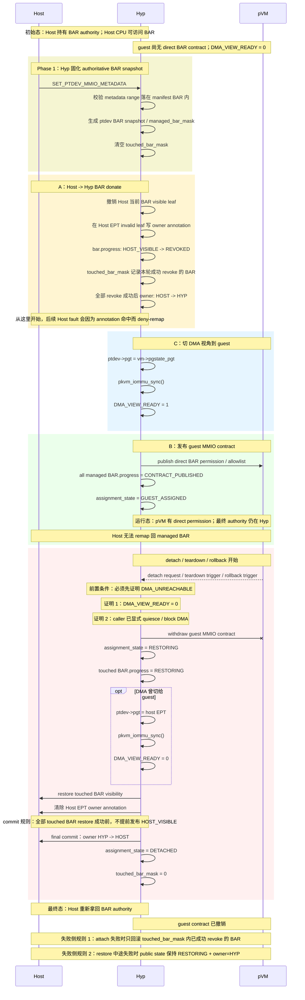
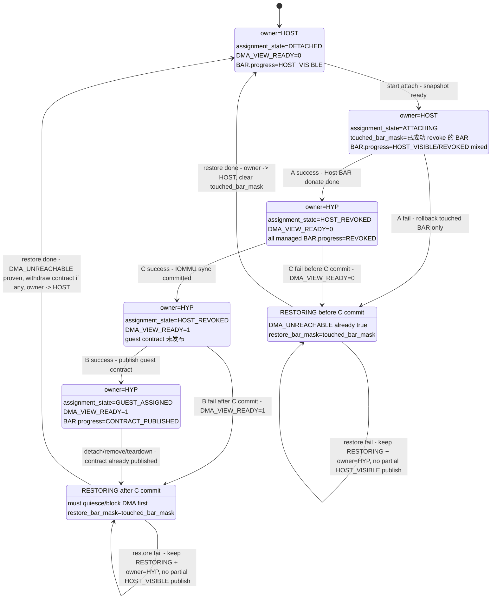

# [T12] B5-3 protected pVM device MMIO donate 机制总设计

## 目的

这份文档作为 `B5-3 / T12` 的总入口，用于汇总当前已经收敛的 device MMIO donate 机制设计结论。

这里的“donate”不是指复用普通 RAM 的 `__pkvm_host_donate_guest()` 实现，而是指：

- Host 必须失去对 assigned device MMIO/BAR 的直接裁决权；
- 设备 MMIO resource 进入由 hyp 维护的 owner/state 生命周期；
- guest 如需 direct permission，也是在 hyp 持有最终 authority 的前提下发布；
- detach / rollback 时再由 hyp 统一把资源 restore 回 Host。

换句话说，第一阶段的目标语义更接近：

```text
Host
  -> donate managed BAR authority to Hyp
  -> Hyp publish guest direct permission
  -> Hyp withdraw permission and restore BAR back to Host
```

而不是把设备 BAR 继续塞进普通 RAM donation 主链。

## 文档关系（总-分）

本文件是总文档；分文档和相关依赖如下：

- `[01E-T12-B5-3-Host-BAR隔离-ARM对齐设计草案.md](01E-T12-B5-3-Host-BAR隔离-ARM对齐设计草案.md)`
  - 保留 ARM 对齐背景、BAR ownership 细节推导和细颗粒度讨论。
- `[04-P0-VM销毁前quiesce-ptdev-DMA.md](04-P0-VM销毁前quiesce-ptdev-DMA.md)`
  - 保留 `T4` 的 DMA-safe barrier 设计与实现结论。
- `[06-P1-VFIO-remove-path与失败回滚.md](06-P1-VFIO-remove-path与失败回滚.md)`
  - 保留 `T6` 的 remove-path、attach-fail caller coverage 和后续回滚收口。

后续如需讨论总方案，以本文为主入口；如需展开 BAR ownership / ARM 对齐背景，再回到分文档。

## 第一阶段范围

第一阶段当前锁定的目标范围：

- protected pVM
- 单个 VFIO PCI device
- 静态 attach
- boot-known memory BAR
- Host CPU 不能继续通过 Host EPT lazy remap 重新访问 assigned BAR
- guest direct BAR 现有路径保持可用
- detach / rollback 的资源恢复必须有一致 contract

第一阶段当前明确不做：

- 严格 ARM-like `OWNER_GUEST`
- hotplug / migration
- 多设备 group 原子切换
- MSI-X table / PBA 的 BAR 子区间 owner 切片
- config space 直达
- reset framework

## 当前已锁定的总设计

### 当前 donate 机制完整工作过程（第一阶段）



### attach A/C/B 状态转换与失败回退图



### 1. `ptdev` 是 x86 侧的 authority object

第一阶段不再单独引入一套平行于 ARM `pkvm_device` 的新对象，而是把 `ptdev` 视为 x86 侧的 device authority object。

它至少需要承载四类真相：

- 设备身份：`bdf` / `pasid` / `did`
- attachment / DMA 视角：`shadow_vm_handle`、`pgt`、`dma_blocked`
- guest MMIO contract：`mmio_metadata`
- BAR resource authority：BAR snapshot、managed set、owner/state、restore bookkeeping

这与当前实现位置是对齐的：

- `pKVM-IA/arch/x86/kvm/vmx/pkvm/hyp/ptdev.c`
- `pKVM-IA/arch/x86/kvm/vmx/pkvm/hyp/ptdev.h`

### 2. 第一阶段不采用严格 `OWNER_GUEST`

第一阶段已明确：

- guest 可以有 direct permission；
- 但最终 authority 仍由 hyp 持有；
- 因而对外更准确的表述是 `GUEST_ASSIGNED + owner=HYP`，而不是 `owner=GUEST`。

当前先不采用严格 `OWNER_GUEST` 的原因是：

- x86 当前已有的 metadata / allowlist 更像“访问许可”，不是完整的“ownership transfer”。
- 当前最直接的 correctness 目标，是收口 Host BAR revoke / deny-remap / restore，而不是先做完整 `Guest -> Hyp` owner reclaim。
- 先保留 `owner=HYP`，能让 attach / detach / rollback contract 更接近当前实现，也更容易与 `T4` / `T6` 解耦。

因此第一阶段只保留设备级 `owner`：

```text
ptdev.owner = HOST | HYP
```

`GUEST` 作为未来扩展预留，不进入本阶段已锁定方案。

### 3. owner 是设备级；BAR 级只跟踪 progress

第一阶段已明确：

- 一个设备只有一个 authoritative owner；
- 不做“不同 BAR 各自拥有不同 owner”的模型；
- BAR 级记录的是执行进度，而不是 BAR 级 owner。

因此状态分层如下：

```text
设备级:
  ptdev.owner
  ptdev.assignment_state

BAR 级:
  bar.progress
```

对应字段语义：

- `ptdev.owner`
  - 谁持有最终 authority
- `ptdev.assignment_state`
  - 设备当前处于 attach / assigned / restore 的哪一阶段
- `bar.progress`
  - 单个 BAR 在该阶段已经走到哪一步

### 4. 先固化 BAR snapshot，再进入 donate / restore

第一阶段已明确：attach 之前，hyp 必须先把 `boot manifest + metadata` 收敛成自己的 BAR snapshot；后续 owner/state/restore 都只认这份 snapshot。

这里“BAR snapshot 已固化”指的是：

- hyp 已经根据 boot manifest 确认了这台设备有哪些可信 BAR resource；
- hyp 已经根据 metadata 判断哪些 BAR / 子区间要对 guest direct；
- hyp 已经把后续要管理的 BAR 集合固定为内部 authoritative state；
- 但这还不等于 Host 已 revoke、guest contract 已发布、DMA 已切给 guest。

本阶段对应的两个关键账本字段也已锁定为简化版：

```text
managed_bar_mask
  长期字段，表示本设备哪些 BAR 属于 B5-3 管理范围

touched_bar_mask
  单轮字段，表示本轮 attach/remove/restore 真正动过哪些 BAR
```

同时已明确：

- `metadata.generation` 只表示 guest MMIO contract 版本；
- 它不参与 hyp 内部 restore 范围判定；
- restore 范围只看 `touched_bar_mask`。

相关字段位置：

- `pKVM-IA/arch/x86/include/asm/kvm_host.h`
- `pKVM-IA/arch/x86/include/uapi/asm/kvm.h`

### 5. assigned 设备的 managed set 必须完整

第一阶段已锁定的 managed set 规则：

- 一个已经分配给 pVM 的 `ptdev`，其 boot manifest / BAR snapshot 中确认的设备 MMIO BAR，都必须进入 `managed_bar_mask`。
- 不允许出现“设备已经 `GUEST_ASSIGNED`，但某个 managed BAR 仍然 `HOST_VISIBLE`”的状态。

这条规则的核心目的是避免出现：

```text
同一台已经 assigned 的设备
  一部分 BAR 已经进入 guest contract
  另一部分 BAR 仍然保留 Host 侧可见
```

这会让“设备已经透传给 pVM”这个事实在 Host CPU 视角上不再自洽。

### 6. MSI-X table / PBA 不进 guest direct subset，但 BAR 仍受管理

第一阶段已选定的策略是：

- MSI-X table / PBA 继续 trap/emulate；
- 不把它们纳入 guest direct subset；
- 也不要求第一阶段先实现 BAR 子区间 owner/state 切片。

但这不等于 Host 保留这些 BAR 的 owner 或直接访问权。

更准确的语义是：

```text
BAR 属于 managed set
Host BAR 映射已 revoke
guest direct subset 排除 MSI-X / PBA 子区间
MSI-X / PBA 继续 trap/emulate
```

## 状态机与不变量

### 设备级 public state

第一阶段当前锁定的设备级 public state：

```text
DETACHED
ATTACHING
HOST_REVOKED
GUEST_ASSIGNED
RESTORING
```

其中 `HOST_REVOKED` 保留为 public state；DMA 视角是否已经切到 guest，只通过内部位表达：

```text
DMA_VIEW_READY = 0 | 1
```

第一阶段不再单独把“DMA 已切给 guest”升成新的 public state。

### BAR 级 progress

第一阶段当前锁定的 BAR 级 progress：

```text
HOST_VISIBLE
REVOKED
CONTRACT_PUBLISHED
RESTORING
```

这里的 `CONTRACT_PUBLISHED` 表示“该 BAR 的 guest-side contract 已发布”，不是说 BAR owner 已切成 guest。

### 状态不变量总表

```text
DETACHED
  ptdev.owner = HOST
  ptdev.assignment_state = DETACHED
  DMA_VIEW_READY = 0
  guest contract = 未发布
  所有 managed BAR.progress = HOST_VISIBLE
  touched_bar_mask = 0

ATTACHING
  ptdev.owner = HOST
  ptdev.assignment_state = ATTACHING
  DMA_VIEW_READY = 0
  guest contract = 未发布
  managed BAR.progress = HOST_VISIBLE / REVOKED 可混合
  touched_bar_mask = 本轮已成功 revoke 的 BAR

HOST_REVOKED
  ptdev.owner = HYP
  ptdev.assignment_state = HOST_REVOKED
  DMA_VIEW_READY = 0 或 1
  guest contract = 未发布
  所有 managed BAR.progress = REVOKED
  touched_bar_mask = managed_bar_mask

GUEST_ASSIGNED
  ptdev.owner = HYP
  ptdev.assignment_state = GUEST_ASSIGNED
  DMA_VIEW_READY = 1
  guest contract = 已发布
  所有 managed BAR.progress = CONTRACT_PUBLISHED

RESTORING
  ptdev.owner = HYP
  ptdev.assignment_state = RESTORING
  DMA_VIEW_READY = 0，且 DMA 必须已不可达
  guest contract = 对 guest 不再可用
  所有 managed BAR.progress = RESTORING
  touched_bar_mask = 本轮需要 restore 的 BAR
```

对应还锁定了两条关键不变量：

- `ATTACHING` 允许部分 BAR 已经 `REVOKED`，因为这只是在提前收紧 Host 能力。
- `RESTORING` 不允许任何 managed BAR 提前回到 `HOST_VISIBLE`；`HOST_VISIBLE` 只能在全部 restore 成功后作为 final commit 一次性发布。

## attach contract

第一阶段当前锁定的 attach 主线如下：

```text
DETACHED
  -> ATTACHING
      A: revoke Host BAR access
  -> HOST_REVOKED
      C: switch DMA view to guest-side pgstate
      B: publish guest MMIO contract
  -> GUEST_ASSIGNED
```

其中：

- `A` = 撤销 Host BAR 访问权 / Host BAR donate to Hyp
- `C` = 切换 DMA 视角
- `B` = 发布 guest MMIO contract

当前已经锁定的结论是：

- 真正的安全分界点是 `A`；
- 只要 `A` 做到了，Host CPU 就不能继续通过 Host EPT remap 回已 assigned BAR；
- `B/C` 的先后主要影响 attach 完整性，而不是 Host 隔离本身；
- 第一阶段推荐顺序为 `A -> C -> B`。

这里的 “Host BAR donate to Hyp” 具体不要求复用普通 RAM donate helper，但语义必须是：

```text
Host BAR visible
  -> Host EPT revoke / invalid owner annotation
  -> ptdev.owner = HYP
  -> managed BAR.progress = REVOKED
```

当前相关实现锚点：

- attach 主链：`pKVM-IA/arch/x86/kvm/vmx/pkvm/hyp/ptdev.c`
- guest MMIO contract publish：`pKVM-IA/arch/x86/kvm/vmx/pkvm/hyp/ptdev.c`

## restore / rollback contract

### restore 范围

第一阶段已明确：

```text
restore_bar_mask = touched_bar_mask
```

不再把 `generation` 当作 hyp 内部 restore selector。

但这里要特别说明：`touched_bar_mask` 只定义 **BAR restore 的资源范围**，不等于“完整 rollback 只做 BAR restore”。

第一阶段的完整 rollback / restore 语义，至少同时覆盖 4 个平面：

```text
1. guest contract 平面
   - 如果 guest MMIO contract / allowlist 已发布
   - rollback 时需要先 withdraw

2. DMA view 平面
   - 如果 DMA_VIEW_READY = 1
   - rollback 时需要把 ptdev->pgt 切回 host EPT
   - 然后做 pkvm_iommu_sync()

3. Host BAR visibility 平面
   - 对 restore_bar_mask = touched_bar_mask 内的 BAR
   - 清 Host EPT owner annotation
   - 恢复 Host BAR visible leaf

4. bookkeeping / device state 平面
   - ptdev.owner / assignment_state 回到稳定态
   - touched_bar_mask 清零
```

因此当前文档中的：

```text
rollback scope = touched_bar_mask
```

更准确的解读应是：

```text
rollback 的 BAR 资源范围 = touched_bar_mask
完整 rollback 动作 != 只恢复这些 BAR
```

### restore 前置条件

任何进入 BAR restore 的路径，都必须先满足：

```text
DMA_UNREACHABLE
```

合法证明只有两种：

```text
证明 1：
  DMA_VIEW_READY = 0
  即 DMA 视角尚未真正切给 guest

证明 2：
  调用者已经显式完成 block / quiesce
  即 DMA 之前可能切给过 guest，但现在已被 hyp 明确切断
```

对应的职责边界也已锁定：

- `restore helper` 不负责替调用者做 quiesce；
- 但任何调用 restore helper 的路径，都必须先证明 `DMA_UNREACHABLE` 成立。

### attach-fail before / after C 分叉

这里先把 `C` 定义为 **guest DMA view commit 成功**，而不是“代码曾经写过 `ptdev->pgt`”：

```text
C commit = ptdev->pgt 指向 vm->pgstate_pgt
         + pkvm_iommu_sync() 成功
         + DMA_VIEW_READY = 1
```

因此 attach-fail 只按两个大分叉处理：

```text
fail before C commit
  guest DMA view 尚未真正生效
  -> rollback 不需要先 quiesce
  -> 直接按 rollback 四平面处理
  -> DMA view 平面通常是 no-op

fail after C commit
  guest DMA view 已经真正生效
  -> rollback 前必须先证明 DMA_UNREACHABLE
  -> quiesce / block 成功后才能进入 RESTORING
```

before C 的 rollback 动作：

```text
guest contract 平面
  - 如果 B 尚未发布：no-op
  - 如果因异常顺序已经发布：仍必须 withdraw

DMA view 平面
  - DMA_VIEW_READY = 0
  - 不需要 quiesce
  - 如果 ptdev->pgt 曾被临时改过但 sync 失败，应恢复为 host EPT

Host BAR visibility 平面
  - 只 restore touched_bar_mask 内已 revoke 的 BAR
  - 清 owner annotation / 恢复 Host visible leaf

bookkeeping 平面
  - ptdev.owner -> HOST
  - assignment_state -> DETACHED
  - touched_bar_mask = 0
```

after C 的 rollback 动作：

```text
前置
  - 必须先 quiesce / block DMA
  - 或等价证明 DMA_UNREACHABLE

guest contract 平面
  - 如果 B 已发布：withdraw allowlist / direct BAR contract
  - 如果 B 未发布：no-op，但状态仍按 RESTORING 收口

DMA view 平面
  - ptdev->pgt = host EPT
  - pkvm_iommu_sync()
  - DMA_VIEW_READY = 0

Host BAR visibility 平面
  - restore touched_bar_mask 内 BAR
  - 不允许部分 BAR 提前 public HOST_VISIBLE

bookkeeping 平面
  - 全部 restore 成功后：
      ptdev.owner -> HOST
      assignment_state -> DETACHED
      touched_bar_mask = 0
```

### detach / remove / teardown 三段式

当前已锁定的逻辑分层如下：

```text
Phase 1: DMA barrier
  caller / T4
    -> quiesce / block DMA
    -> 证明 DMA_UNREACHABLE

Phase 2: Enter RESTORING
  T12
    -> withdraw guest contract
    -> managed BAR.progress = RESTORING
    -> ptdev.assignment_state = RESTORING

Phase 3: Restore + final host commit
  T12
    -> restore touched BAR
    -> 全部成功后一次性发布 HOST_VISIBLE
    -> ptdev.owner = HOST
    -> ptdev.assignment_state = DETACHED
```

这也意味着：

- `T12` 只定义 BAR owner/state restore contract；
- `T4` 继续提供 DMA-safe barrier；
- `T6` 继续覆盖 remove-path / attach-fail 的 caller side 编排。

## 与当前实现的映射

当前已经存在、并与上述 contract 对齐的关键路径如下：

- `pkvm_quiesce_ptdev()` 负责设置 `dma_blocked` 并触发 IOMMU 同步：
  - `pKVM-IA/arch/x86/kvm/vmx/pkvm/hyp/ptdev.c`
- `pkvm_attach_ptdev()` 当前会把 `ptdev->pgt` 切到 `&vm->pgstate_pgt`：
  - `pKVM-IA/arch/x86/kvm/vmx/pkvm/hyp/ptdev.c`
- `pkvm_detach_ptdev()` 当前仍是折叠实现，一次性清 metadata、切回 host `pgt`、unlink、sync IOMMU：
  - `pKVM-IA/arch/x86/kvm/vmx/pkvm/hyp/ptdev.c`
- `pkvm_set_ptdev_mmio_metadata()` 当前一次性接收整份 metadata，并发布 allowlist：
  - `pKVM-IA/arch/x86/kvm/vmx/pkvm/hyp/ptdev.c`
- `dma_blocked` 对 IOMMU shadow context / PASID entry 的阻断效应：
  - `pKVM-IA/arch/x86/kvm/vmx/pkvm/hyp/shadow_iommu.c`
- IOMMU 同步入口：
  - `pKVM-IA/arch/x86/kvm/vmx/pkvm/hyp/iommu.c`

因此本轮设计文档的关键收敛点是：

- 当前实现已经具备 DMA 视角切换和 block 的基础能力；
- 但还没有把 Host BAR donate / owner annotation / restore contract 纳入同一套 authoritative state；
- `T12` 要补的是这条 owner/state 主线，而不是把 MMIO 重新塞回普通 RAM donation。

## 第一阶段实现前置决策（2026-04-24）

本节用于把第一阶段进入 implementation plan 之前必须定死的工程选择收口。

结论：当前设计可以进入 **第一阶段实现规划**，但这里的“第一阶段”只表示
`T12` 的最小 BAR authority 主线，不表示完整 passthrough lifecycle 已全部完成。
`T6` remove-path、reset/group 原子性、严格 `OWNER_GUEST` 仍按后续阶段处理。

### D0. 第一阶段实现边界

第一阶段实现只承诺以下闭环：

```text
single protected pVM
  + single boot-known VFIO PCI device
  + boot manifest memory BAR snapshot
  + Host EPT owner annotation deny-remap
  + existing guest DIRECT_BAR allowlist remains usable
  + detach / teardown / attach-fail rollback enters unified restore helper
```

第一阶段不把以下内容纳入完成条件：

- 完整 VFIO `FILE_DEL` / group remove-path 编排；这仍归 `T6`。
- reset framework、hotplug、migration、多设备 group 原子切换。
- MSI-X table / PBA 的 BAR 子区间 owner 切片。
- config space direct access。
- 严格 ARM-like `OWNER_GUEST`。

### D1. `ptdev` 状态字段落点

第一阶段在 x86 侧继续把 `struct pkvm_ptdev` 作为 authority object，不另建平行
`pkvm_device` 对象。建议字段落在：

- `pKVM-IA/arch/x86/kvm/vmx/pkvm/hyp/ptdev.h`
- `pKVM-IA/arch/x86/kvm/vmx/pkvm/hyp/ptdev.c`

第一版字段形态按下面的语义收敛，具体命名可在实现时保持内核风格：

```c
enum pkvm_ptdev_owner {
        PKVM_PTDEV_OWNER_HOST,
        PKVM_PTDEV_OWNER_HYP,
};

enum pkvm_ptdev_assignment_state {
        PKVM_PTDEV_DETACHED,
        PKVM_PTDEV_ATTACHING,
        PKVM_PTDEV_HOST_REVOKED,
        PKVM_PTDEV_GUEST_ASSIGNED,
        PKVM_PTDEV_RESTORING,
};

enum pkvm_ptdev_bar_progress {
        PKVM_PTDEV_BAR_HOST_VISIBLE,
        PKVM_PTDEV_BAR_REVOKED,
        PKVM_PTDEV_BAR_CONTRACT_PUBLISHED,
        PKVM_PTDEV_BAR_RESTORING,
};

struct pkvm_ptdev_bar_resource {
        u8 bar_index;
        u64 hpa;
        u64 size;
        enum pkvm_ptdev_bar_progress progress;
};
```

`struct pkvm_ptdev` 至少补齐：

```text
owner
assignment_state
dma_view_ready
managed_bar_mask
touched_bar_mask
bars[PCI_STD_NUM_BARS]
```

其中：

- `dma_blocked` 继续表示 caller/T4 是否已经显式 block/quiesce DMA。
- `dma_view_ready` 只表示 `C commit` 是否已经成功。
- `managed_bar_mask` 是长期资源集合。
- `touched_bar_mask` 是单轮 attach / restore 账本。

### D2. BAR snapshot 与 metadata 时序

第一阶段不把 Host BAR revoke 绑定到 metadata direct subset。更稳的落点是：

```text
managed BAR snapshot
  = boot manifest 中该 BDF 的 boot-known memory BAR

guest DIRECT_BAR contract
  = metadata 中通过 manifest/snapshot 校验的 direct 子区间
```

因此时序决策如下：

1. `pkvm_attach_ptdev()` 进入 A 阶段前必须确保 BAR snapshot 存在。
   - 若 snapshot 不存在，则从 boot manifest 生成 `ptdev->bars[]` 与 `managed_bar_mask`。
   - 若 boot manifest 中没有该 BDF 或没有可管理 memory BAR，则 protected pVM attach 路径失败。
2. `SET_PTDEV_MMIO_METADATA` 负责校验并缓存 guest direct intent。
   - metadata range 必须落在已知 BAR snapshot / manifest BAR 内。
   - metadata 不决定 Host restore 范围；restore 范围仍只看 `touched_bar_mask`。
3. metadata 到达顺序不应破坏状态机。
   - metadata 早于 A/C：只缓存和验证，不提前 publish allowlist。
   - metadata 晚于 A/C：如果 `owner=HYP` 且 `dma_view_ready=1`，可在 metadata hypercall 中完成 B。
   - A/C 已完成但 metadata 尚未到达时，设备停在 `HOST_REVOKED + dma_view_ready=1 + guest contract 未发布`。

这能同时兼容当前源码中 `pkvm_attach_ptdev()` 与
`pkvm_set_ptdev_mmio_metadata()` 分属两条入口的事实。

### D3. guest contract publish 不再等同 metadata 缓存

当前 `pkvm_set_ptdev_mmio_metadata()` 收到 metadata 后会直接更新 VM allowlist。
第一阶段实现必须把它拆成两个语义步骤：

```text
cache/validate metadata
  -> 记录 mmio_metadata / mmio_metadata_valid
  -> 校验 ranges 落在 ptdev BAR snapshot 内

publish guest contract
  -> 只允许在 Host BAR 已 revoke 后执行
  -> 要求 ptdev.owner == HYP
  -> 要求 assignment_state == HOST_REVOKED 或 GUEST_ASSIGNED
  -> 要求 dma_view_ready == 1
  -> 更新 vm->mmio_allow_ranges
  -> managed BAR.progress = CONTRACT_PUBLISHED
  -> assignment_state = GUEST_ASSIGNED
```

detach / rollback 时则必须先 withdraw guest contract，再进入 Host BAR restore。

### D4. Host EPT annotation 编码

第一阶段 **不能直接使用 `OWNER_ID_HYP` 作为 BAR annotation owner id**。

原因是当前编码里：

```text
OWNER_ID_HYP = 0
PKVM_NOPAGE = 0
invalid PTE annotation = FIELD_PREP(owner_mask, owner_id) | PKVM_NOPAGE
```

如果 owner id 取 0，Host EPT invalid leaf 的 annotation 也可能表现为 0，
无法和真正 empty MMIO hole 区分；Host fault path 也就不能可靠 deny-remap。

第一阶段决策：

```text
ptdev.owner
  = HOST | HYP       // 设备级 authority 语义

Host EPT invalid annotation owner tag
  = non-zero reserved MMIO/BAR tag
  != OWNER_ID_HYP
  != OWNER_ID_HOST
```

也就是说，annotation tag 是 Host fault deny-remap 的编码标记，
不等同于把设备 owner 语义切成 `OWNER_GUEST`。

实现时应新增一个非零、非 Host 的 reserved tag，例如：

```text
OWNER_ID_PTDEV_MMIO 或 PKVM_MMIO_OWNER_TAG_PTDEV
```

并用 `BUILD_BUG_ON()` 或等价静态检查保证它不会与当前 VM handle owner-id 空间冲突。
如果后续需要按设备/BAR 细分审计，再从这个 reserved tag 演进到 per-ptdev owner id。

### D5. Host EPT helper/API 粒度

第一阶段不复用普通 RAM donation 主链，但可以复用底层 pgtable annotation 能力。
推荐新增 Host EPT 层或 ptdev MMIO 层 wrapper，而不是把 `ptdev.c` 直接耦合到
`mem_protect.c` 的静态 helper：

```text
pkvm_host_ept_annotate_mmio_owner(hpa, size, owner_tag)
    -> host_ept_lock()
    -> pkvm_pgtable_annotate(host_ept, hpa, size, annotation)
    -> pkvm_flush_host_ept()
    -> host_ept_unlock()

pkvm_host_ept_restore_mmio_idmap(hpa, size, prot)
    -> host_ept_lock()
    -> pkvm_host_ept_map(hpa, hpa, size, 1 << PG_LEVEL_4K, prot)
    -> pkvm_flush_host_ept()
    -> host_ept_unlock()

pkvm_host_ept_lookup_mmio_annotation(gpa, result)
    -> distinguish PRESENT / ANNOTATED / EMPTY
```

这里强制第一版使用 4K granularity，原因是：

- `pkvm_pgtable_annotate()` 当前按 4K leaf 写 annotation。
- BAR direct 子区间和 MSI-X/PBA 排除可能不是 hugepage 对齐。
- restore 不应因为 huge mapping 覆盖到相邻 MMIO hole 或非 managed BAR。

### D6. Host EPT fault deny-remap 规则

`handle_host_ept_violation()` 的第一阶段修改点只应依赖 Host EPT annotation，
不再扫描 manifest 全表做地址黑名单：

```text
handle_host_ept_violation(gpa)
    -> pkvm_host_ept_lookup_mmio_annotation(gpa)
        PRESENT
            -> return -EAGAIN
        ANNOTATED with non-Host ptdev MMIO tag
            -> return -EPERM
        EMPTY
            -> continue normal MMIO hole lazy map
```

这样 Host fault 的判定来源就是 A 阶段写入 Host EPT 的 owner annotation，
而不是“地址是否碰巧属于某个 manifest BAR”。

### D7. attach A/C/B 的工程顺序

第一阶段实现顺序固定为 `A -> C -> B`：

```text
pkvm_attach_ptdev()
    -> get/create ptdev
    -> prepare BAR snapshot from boot manifest if needed
    -> assignment_state = ATTACHING
    -> dma_view_ready = 0
    -> touched_bar_mask = 0

    A: revoke Host BAR visibility
        -> for each managed BAR
            -> pkvm_host_ept_annotate_mmio_owner()
            -> progress = REVOKED
            -> touched_bar_mask |= BIT(bar)
        -> all success
            -> owner = HYP
            -> assignment_state = HOST_REVOKED

    C: switch DMA view
        -> ptdev->pgt = &vm->pgstate_pgt
        -> link ptdev to vm
        -> pkvm_iommu_sync()
        -> on success: dma_view_ready = 1
        -> on failure before C commit: rollback touched BAR without quiesce

    B: publish guest contract if metadata is already valid
        -> update VM allowlist
        -> progress = CONTRACT_PUBLISHED
        -> assignment_state = GUEST_ASSIGNED
```

C 失败时必须注意：`dma_view_ready` 只有在 `pkvm_iommu_sync()` 成功之后才能置 1。
如果代码已经临时改过 `ptdev->pgt`，但 sync 失败，rollback 前必须把 `ptdev->pgt`
恢复为 host EPT。

### D8. restore helper 的第一版 contract

第一阶段统一 restore helper 建议按下面语义收敛：

```text
pkvm_restore_ptdev_bars(ptdev, vm, dma_unreachable_proven)
    -> require dma_unreachable_proven
       or dma_view_ready == 0
    -> assignment_state = RESTORING
    -> withdraw guest contract if published
    -> if dma_view_ready == 1
        -> ptdev->pgt = host EPT
        -> pkvm_iommu_sync()
        -> dma_view_ready = 0
    -> for each touched BAR
        -> pkvm_host_ept_restore_mmio_idmap(HOST_EPT_DEF_MMIO_PROT)
    -> only after all touched BAR restore success
        -> progress = HOST_VISIBLE
        -> owner = HOST
        -> assignment_state = DETACHED
        -> touched_bar_mask = 0
```

restore prot 使用当前 Host EPT lazy MMIO map 同源的默认 prot：

```text
pkvm_mkstate(HOST_EPT_DEF_MMIO_PROT, PKVM_PAGE_OWNED)
```

restore 失败语义：

- 如果 `pkvm_iommu_sync()` 失败，不能进入 Host BAR restore。
- 如果 Host BAR restore 中途失败，public state 保持 `RESTORING + owner=HYP`。
- retry 必须能容忍个别 BAR leaf 已经被 restore 成 Host visible。
- 任何情况下都不能提前清空 `touched_bar_mask` 或 `pkvm_put_ptdev()`。

这里的“public state 不提前发布 HOST_VISIBLE”指 `ptdev` owner/state/progress 不提前
commit；实际 Host EPT leaf 如果已经在 DMA unreachable 且 guest contract 已撤销之后恢复，
后续 retry 需把它当作 restore internal prepare 的部分成功结果处理。

### D9. 第一阶段最小验证边界

遵守本仓库规则，第一阶段默认不主动发起全量 Linux 内核构建。

implementation plan 中的验证应按最小范围组织：

- 静态检查：确认新增 enum/helper 调用点与状态转换路径覆盖 A/C/B/restore。
- 局部编译建议：只给出 `pKVM-IA` 相关最小对象或目录目标，由用户确认后执行。
- 运行验证建议：复用现有 protected pVM + VFIO 样例，观察：
  - attach 后 Host EPT managed BAR leaf 变成 annotated invalid；
  - Host fault 命中 annotation 时 deny-remap；
  - guest `DIRECT_BAR` allowlist 仍可发布；
  - teardown/detach 后 Host EPT BAR idmap 恢复。

## 后续阶段保留问题

以下内容不阻塞第一阶段 implementation plan，但不能在第一阶段 issue / PR 中假装完成：

- per-device / per-BAR owner id，而不是第一阶段 reserved MMIO tag。
- 严格 ARM-like `OWNER_GUEST` 与 Guest -> Hyp owner reclaim。
- `T6` 的完整 VFIO remove-path / `FILE_DEL` / group rollback 编排。
- reset framework 与多设备 group 原子切换。
- MSI-X table / PBA 的 BAR 子区间 owner 切片。

## 分文档入口

- 总入口：`[01E-T12-B5-3-protected-pVM-device-MMIO-donate-机制总设计.md](01E-T12-B5-3-protected-pVM-device-MMIO-donate-机制总设计.md)`
- ARM 对齐与 BAR ownership 细节：`[01E-T12-B5-3-Host-BAR隔离-ARM对齐设计草案.md](01E-T12-B5-3-Host-BAR隔离-ARM对齐设计草案.md)`
- DMA-safe barrier：`[04-P0-VM销毁前quiesce-ptdev-DMA.md](04-P0-VM销毁前quiesce-ptdev-DMA.md)`
- remove-path / 失败回滚：`[06-P1-VFIO-remove-path与失败回滚.md](06-P1-VFIO-remove-path与失败回滚.md)`
