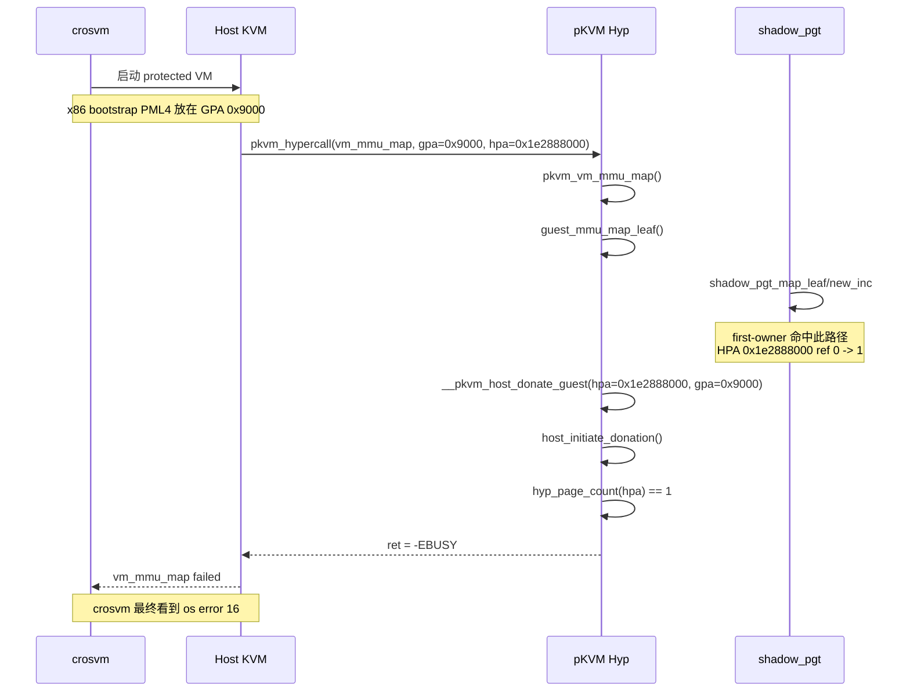

# [BOOT-006] protected VM 启动阶段 GPA `0x9000` 映射冲突分析

## 结论先行

当前已能确定：本次失败不是旧的 `host -> hyp donate` 分支，而是 **protected VM 启动早期，Host 在为 guest GPA `0x9000` 建立私有映射时，`__pkvm_host_donate_guest()` 命中 `-EBUSY`**。

更关键的是，`first-owner` 日志已经给出直接证据：**同一个 HPA `0x1e2888000`，最先把它 `refcount 0 -> 1` 的路径是 `shadow_pgt_map_leaf/new_inc`，且 `aux=0x9000`**。这说明当前冲突不是随机历史污染，而是：

- `shadow pgt` 路径先引用了 `gpa=0x9000` 对应的 HPA
- 随后 `host -> guest donate` 试图把同一页转成 guest-owned
- `host_initiate_donation()` 检查到 `hyp_page.refcount == 1`
- 返回 `-EBUSY`

## 关键证据

### 核心 dmesg（本轮最重要证据）

```text
[   73.968055] pkvm-debug: first-owner table full; suppressing further overflow logs
[   84.805341] pkvm: host_initiate_donation: page refcounted (dma/pinned?) addr=0x1e2888000 size=0x1000 owner_id=1 refcnt=1 busy_hpa=0x1e2888000
[   84.806409] pkvm-debug: first-owner hpa=0x1e2888000 tag=shadow_pgt_map_leaf/new_inc aux=0x9000 caller=pgtable_map_cb__pkvm+0xb9/0x270 seq=15694
[   84.807426] pkvm-debug: trace dump target_hpa=0x1e2888000 nr_entries=4096
[   84.807965] pkvm-debug: trace hpa=0x1e2888000 tag=__pkvm_host_donate_guest/pre old=1 new=1 aux=0x9000
[   84.808688] pkvm-debug: trace hpa=0x1e2888000 tag=host_initiate_donation/fail old=1 new=1 aux=0x1
[   84.809384] pkvm: do_donate: __do_donate failed ret=-16 size=0x1000 init=1 addr=0x1e2888000 phys=0x0 comp=2 addr=0x9000 phys=0x1e2888000 prot=0x77
[   84.810540] pkvm: __pkvm_host_donate_guest failed ret=-16 hpa=0x1e2888000 gpa=0x9000 size=0x1000 prot=0x77
[   84.811354] kvm: pkvm: vm_mmu_map failed ret=-16 gpa=0x9000 hpa=0x1e2888000 size=0x1000 writable=1 goal_level=1 pfn=0x1e2888
```

### 这几行日志分别证明了什么

1. `first-owner ... tag=shadow_pgt_map_leaf/new_inc aux=0x9000`

   这行是当前最核心的证据。它证明：

   - `HPA 0x1e2888000` 第一次被 `ref` 住时，来源路径是 `shadow_pgt_map_leaf/new_inc`
   - `aux=0x9000`，说明这次 first-owner 记录关联的虚拟地址上下文就是 `0x9000`

2. `__pkvm_host_donate_guest/pre ... aux=0x9000`

   这证明当前失败确实发生在 `__pkvm_host_donate_guest()`，而且 donation 目标 GPA 就是 `0x9000`。

3. `comp=2 addr=0x9000 phys=0x1e2888000`

   结合 `arch/x86/kvm/vmx/pkvm/hyp/mem_protect.c` 中 `enum pkvm_component_id`：

   - `PKVM_ID_HYP = 0`
   - `PKVM_ID_HOST = 1`
   - `PKVM_ID_GUEST = 2`

   因此这里明确表示：**本次 donation 是 `host -> guest`**，不是 `host -> hyp`。

4. `vm_mmu_map failed ret=-16 gpa=0x9000 hpa=0x1e2888000`

   这说明 Host 侧最终看到的失败，就是 `vm_mmu_map()` 在尝试为 GPA `0x9000` 建 guest 私有映射时返回 `-EBUSY`。

## 归纳分析

### 一、为什么 `vm_mmu_map()` 会被调用

这次 `gpa=0x9000` 并不是随机地址。`crosvm` 在 x86 启动路径里，会把 bootstrap PML4 放在 `0x9000`：

- `crosvm/x86_64/src/regs.rs`

```rust
let boot_pml4_addr = GuestAddress(0x9000);
```

这意味着 guest vCPU 在 very early boot 阶段访问 `0x9000` 是预期行为。对应地，Host KVM 在 stage-2 尚未建立映射时，会进入：

    kvm_tdp_page_fault()
        pkvm_page_fault()
            pkvm_hypercall(vm_mmu_map, ...)

相关源码：

- `pKVM-IA/arch/x86/kvm/mmu/mmu.c`
- `pKVM-IA/arch/x86/kvm/pkvm/mmu.c`

所以：**`vm_mmu_map(gpa=0x9000, ...)` 是 protected VM 启动早期访问启动页表页触发的正常路径。**

### 二、为什么能确定这次走的是 `vm_mmu_map -> __pkvm_host_donate_guest()`

调用链可以从源码直接还原：

    Host KVM
        pkvm_page_fault(...)                                    (pKVM-IA/arch/x86/kvm/mmu/mmu.c)
            pkvm_hypercall(vm_mmu_map, ...)

    pKVM Hyp
        pkvm_vm_mmu_map(...)                                    (pKVM-IA/arch/x86/kvm/pkvm/mmu.c)
            guest_mmu_map_leaf(...)
                __pkvm_host_donate_guest(...)                   (pKVM-IA/arch/x86/kvm/vmx/pkvm/hyp/mem_protect.c)
                    do_donate(...)
                        host_initiate_donation(...)

其中 `guest_mmu_map_leaf()` 对 protected VM 走的是：

- `__pkvm_host_donate_guest(...)`

而不是非 protected VM 的：

- `__pkvm_host_share_guest(...)`

因此当前这次失败，已经可以和旧的 `pkvm_vcpu_create -> __pkvm_host_donate_hyp` 分支明确区分开。

### 三、`first-owner=shadow_pgt_map_leaf/new_inc` 到底证明了什么

这行日志的含义是：

- 在 `__pkvm_host_donate_guest()` 试图 donation 之前
- `shadow_pgt_map_leaf()` 已经先对同一个 HPA 做了 `new_inc`
- 并且这个 `new_inc` 关联的地址上下文也是 `0x9000`

这说明当前不是“某个无关路径历史上碰巧把页污染了”，而是**同一个 `gpa=0x9000 / hpa=0x1e2888000` 对，先进入了 shadow pgt 的引用路径，后又进入了 host->guest donation 路径**。

换句话说，当前更像是 **顺序/语义冲突**，不是单纯的“内存页随机 refcount 泄漏”。

## 时序图



## 结论收束

当前已经可以把问题收敛成一句话：

**protected VM 启动阶段对 GPA `0x9000` 建立 guest 私有映射时，`shadow_pgt_map_leaf/new_inc` 先引用了同一个 HPA，导致后续 `__pkvm_host_donate_guest()` 命中 `refcnt=1` 并返回 `-EBUSY`。**

这比“`do_donate` 为什么失败”更接近当前真正的问题本体。

## 下一步

1. 继续围绕 `shadow_pgt_map_leaf/new_inc` 补上下文日志，重点确认：

   - 它属于哪一类 shadow pgt
   - 对应的 `ptdev / bdf / pasid / did`
   - 为什么会在 `host->guest donate` 之前触发

2. 在 `shadow_pgt_map_leaf()` 周围补最小上下文日志，而不是继续扩散到更多不相关路径。

3. 保留当前 first-owner 机制，用来确认后续失败页是否仍然稳定落在 `shadow_pgt_map_leaf/new_inc`。
