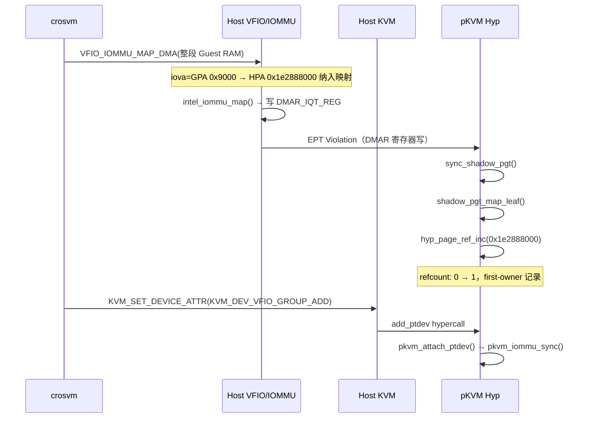
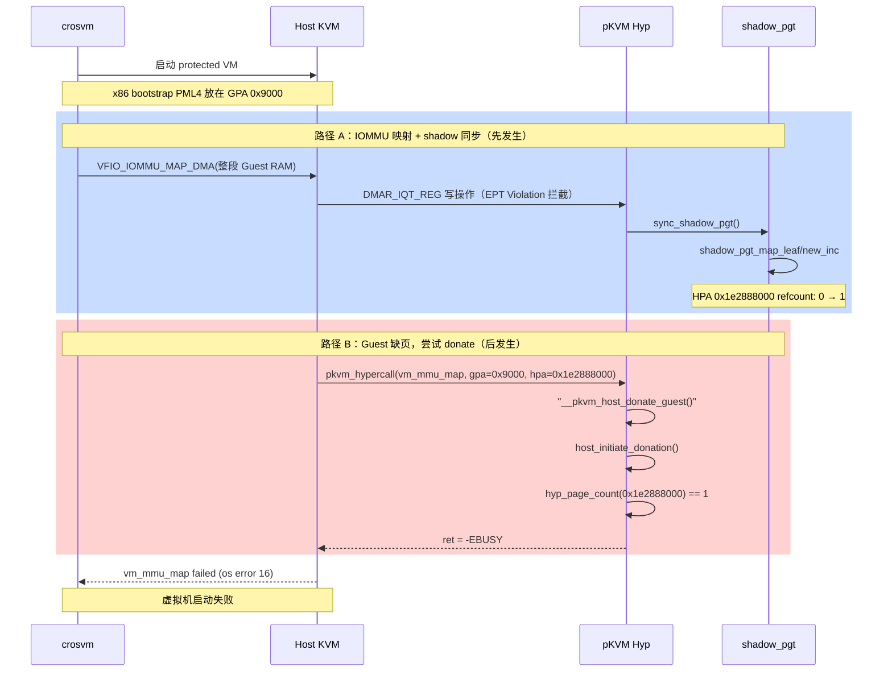

# pVM 在透传 NVME 设备情况下启动失败（内核 panic）

## 问题现象

以透传方式为 pVM 挂载 NVME 设备、且未为该 pVM 启用 IOMMU 模拟时，虚拟机启动失败，内核打印如下日志：

```C
[   73.968055] pkvm-debug: first-owner table full; suppressing further overflow logs
[   84.805341] pkvm: host_initiate_donation: page refcounted (dma/pinned?) addr=0x1e2888000 size=0x1000 owner_id=1 refcnt=1 busy_hpa=0x1e2888000
[   84.806409] pkvm-debug: first-owner hpa=0x1e2888000 tag=shadow_pgt_map_leaf/new_inc aux=0x9000 caller=pgtable_map_cb__pkvm+0xb9/0x270 seq=15694
[   84.807965] pkvm-debug: trace hpa=0x1e2888000 tag=__pkvm_host_donate_guest/pre old=1 new=1 aux=0x9000
[   84.808688] pkvm-debug: trace hpa=0x1e2888000 tag=host_initiate_donation/fail old=1 new=1 aux=0x1
[   84.809384] pkvm: do_donate: __do_donate failed ret=-16 size=0x1000 init=1 addr=0x1e2888000 phys=0x0 comp=2 addr=0x9000 phys=0x1e2888000 prot=0x77
[   84.810540] pkvm: __pkvm_host_donate_guest failed ret=-16 hpa=0x1e2888000 gpa=0x9000 size=0x1000 prot=0x77
[   84.811354] kvm: pkvm: vm_mmu_map failed ret=-16 gpa=0x9000 hpa=0x1e2888000 size=0x1000 writable=1 goal_level=1 pfn=0x1e2888
```

关键信息解读：

- `refcnt=1`：物理页 `0x1e2888000` 在 `host_initiate_donation` 阶段已有引用计数，donate 被拒绝（返回 `-EBUSY`，即 error 16）
- `first-owner tag=shadow_pgt_map_leaf/new_inc`：该页的第一次引用来自 `shadow_pgt_map_leaf`，即 shadow IOMMU 页表同步路径
- `vm_mmu_map failed`：Host 无法将此页 donate 给 Guest，EPT Violation 处理失败，虚拟机启动中断

## 结论

这个 panic 由以下两条路径的 refcount 冲突导致，并非代码 bug，而是当前设计未考虑透传设备给 pVM 的场景。

**路径 A（先发生）**：crosvm 将整段 Guest RAM 注册到 Host IOMMU 以支持设备透传。pKVM 检测到 IOMMU 页表更新后，通过 `sync_shadow_pgt()` 将映射同步到 Hyp 侧的 shadow IOMMU 页表，并对每个映射的物理页调用 `hyp_page_ref_inc()`，标记该页被 IOMMU 引用（refcount: 0 → 1）。

**路径 B（后发生）**：Guest 启动时触发 EPT Violation，Host 尝试将对应物理页 donate 给 Guest。`host_initiate_donation()` 检查到该页 refcount 不为 0，认为该页仍被 DMA 占用，拒绝 donate，返回 `-EBUSY`。

两条路径操作的是同一批物理页——crosvm 会将整段 Guest 地址空间都映射进 IOMMU（路径 A），而 Guest 启动时也需要访问这段地址空间的页面（路径 B），冲突不可避免。

## 根因分析

### 路径 A：IOMMU 页表建立 + shadow IOMMU 同步

crosvm 以透传模式启动时，通过 `VFIO_IOMMU_MAP_DMA` 将整段 Guest RAM 注册到 Host IOMMU，建立从 IOVA（等于 GPA）到 HPA 的 DMA 映射。Host IOMMU 驱动随后更新页表，并通过写 DMAR 寄存器完成 TLB 失效。pKVM 拦截到该寄存器写操作后，调用 `sync_shadow_pgt()` 将 Host IOMMU 页表同步到 Hyp 侧的 shadow IOMMU 页表，同步过程中对每个叶节点指向的物理页执行 `hyp_page_ref_inc()`。

完整调用链如下：

```c
[crosvm 用户态]
ioctl(iommu_fd, VFIO_IOMMU_MAP_DMA)
  iova=0, vaddr=Guest内存HVA, size=${RAM}MB

[内核 drivers/vfio/vfio_iommu_type1.c]
vfio_iommu_type1_map_dma()                            [vfio_iommu_type1.c:2808]
  → vfio_dma_do_map()                                 [vfio_iommu_type1.c:1541]
    → vfio_pin_map_dma(iommu, dma, ${RAM}MB)          [vfio_iommu_type1.c:1441]
      loop 逐批:
        → vfio_pin_pages_remote()                     [vfio_iommu_type1.c:1456]
            get_user_pages(HVA+0x9000) → PFN 0x1e2888
        → vfio_iommu_map(iova=0x9000, pfn=0x1e2888)  [vfio_iommu_type1.c:1466]

[内核 drivers/iommu/intel/iommu.c]
intel_iommu_map()
  → __domain_mapping()
    → iommu_flush_iotlb_psi()
      → qi_flush_iec()
        → 写 DMAR_IQT_REG                             ← pKVM 拦截点

[Hyp 侧 hyp/shadow_iommu.c]
pkvm_access_iommu(DMAR_IQT_REG, write)
  → handle_qi_invalidation()
    → handle_descriptor(QI_CC_TYPE)
      → context_cache_invalidate()
        → sync_shadow_id()
          → sync_shadow_context_entry()
            → sync_shadow_pgt()                       [shadow_iommu.c:422]
              → pkvm_pgtable_sync_map_range()
                → pgtable_walk(pgtable_sync_map_cb)
                  → pgtable_sync_map_cb()
                    → pkvm_pgtable_map(shadow_pgt_map_leaf)
                      → pgtable_walk(pgtable_map_cb)
                        → pgtable_map_cb()            ← 日志中的 caller
                          → pgtable_map_try_leaf()
                            → shadow_pgt_map_leaf()   [shadow_iommu.c:330]
                              → hyp_page_ref_inc(0x1e2888000)  [shadow_iommu.c:380]
                                refcount: 0 → 1       ← first-owner 记录
```

此路径执行的时序如下：




> **关于 GPA 0x9000**：crosvm 硬编码了 x86 bootstrap 阶段的第一级页表（PML4）地址：
>
> ```rust
> let boot_pml4_addr = GuestAddress(0x9000);
> ```
>
> `VFIO_IOMMU_MAP_DMA` 映射的是整段 Guest RAM（从 GPA 0 开始），因此这个地址自然也被纳入 IOMMU 映射范围。[[crossvm是怎么处理带有透传设备的IOMMU页表的]]

> **关于 shadow IOMMU**：pKVM 必须维护 shadow IOMMU 页表以实现对 Host 设备的隔离。

### 路径 B：Guest 触发 EPT Violation，Host 尝试 donate 内存

Guest 启动时，CPU 尝试通过 CR3 寄存器中的地址（GPA 0x9000）访问第一级页表，触发 EPT Violation。Host 内核定位到对应的物理页 `0x1e2888000`，通过 hypercall 请求 pKVM 将该页 donate 给 Guest。pKVM 在 `host_initiate_donation()` 中检查该页的 refcount，发现为 1（已被路径 A 标记），判定该页仍被 DMA 占用，拒绝 donate，返回 `-EBUSY`。

完整调用链如下：

```c
[Host 侧]
kvm_tdp_page_fault()                              [mmu/mmu.c]
  → pkvm_page_fault()
    → pkvm_hypercall(vm_mmu_map, vcpu,            [mmu/mmu.c:4836]
        gpa=0x9000, hpa=0x1e2888000, size=0x1000)

[Hyp 侧]
case __pkvm__vm_mmu_map:                          [pkvm/pkvm.c:2180]
  → pkvm_vm_mmu_map(vcpu, 0x9000, 0x1e2888000)   [pkvm/mmu.c:480]
    → pkvm_pgtable_map(guest_pgt, gpa=0x9000,
        hpa=0x1e2888000,
        map_leaf=guest_mmu_map_leaf)
      → pgtable_walk → pgtable_map_cb
        → pgtable_map_try_leaf
          → guest_mmu_map_leaf()                  [pkvm/mmu.c:385]
            → __pkvm_host_donate_guest(           [mem_protect.c:661]
                hpa=0x1e2888000, gpa=0x9000)
              → do_donate()                       [mem_protect.c:485]
                → __do_donate()                   [mem_protect.c:437]
                  → host_initiate_donation()      [mem_protect.c:355]
                    → hyp_page_count(0x1e2888000)
                      refcount = 1 ≠ 0  ← 失败，return -EBUSY
```

### 两条路径的冲突


|      | 路径 A                             | 路径 B                                   |
| ---- | -------------------------------- | -------------------------------------- |
| 触发时机 | crosvm VFIO_IOMMU_MAP_DMA        | Guest 第一次访问 GPA 0x9000                 |
| 操作   | shadow IOMMU 页表映射，refcount 0 → 1 | Host donate 物理页给 Guest，要求 refcount = 0 |
| 结果   | 成功                               | 失败（-EBUSY）                             |


两条路径操作的是同一批物理页。这不是巧合：crosvm 在启动透传 VM 时，会将整段 Guest 地址空间都映射进 IOMMU（路径 A），而 Guest 启动过程中需要按需建立 EPT 映射，逐页 donate（路径 B），二者对同一批页面操作，冲突不可避免。

## 完整时序




# reference

[[IOMMU]]
[[解决方案设计]]
